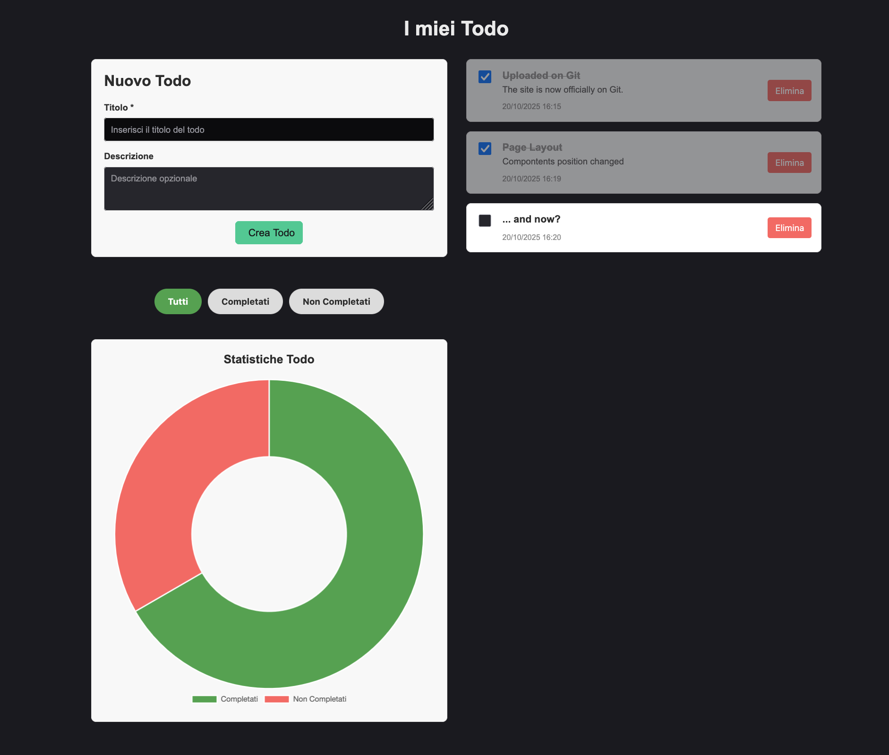

# Todo App
Una semplice applicazione Todo sviluppata con **Angular**, **Quarkus** e **PostgreSQL**.



## Stack Tecnologico
- **Frontend**: Angular 18+ con PrimeNG
- **Backend**: Quarkus (Java - Temurin)
- **Database**: PostgreSQL

## Prerequisiti
- **Java 17+**
- **Node.js 18+**
- **PostgreSQL 12+**
- **Maven**
- **Angular CLI**

## Configurazione Database
1. Apri **pgAdmin** o **DBeaver**
2. Crea un nuovo database chiamato `todo_db`:
   ```sql
   CREATE DATABASE todo_db;
   ```
3. Annota le credenziali di PostgreSQL (username e password)

## Installazione Backend (Quarkus)
1. Entra nella cartella del backend:
   ```bash
   cd todo-backend
   ```

2. Apri il file `src/main/resources/application.properties` e configura:
   ```properties
   quarkus.datasource.db-kind=postgresql
   quarkus.datasource.username=postgres
   quarkus.datasource.password=LA_TUA_PASSWORD
   quarkus.datasource.jdbc.url=jdbc:postgresql://localhost:5432/todo_db
   quarkus.hibernate-orm.database.generation=update
   quarkus.http.cors.enabled=true
   quarkus.http.cors.origins=http://localhost:4200
   ```
   Sostituisci `LA_TUA_PASSWORD` con la tua password PostgreSQL.

3. Avvia il backend in modalità development:
   ```bash
   ./mvnw quarkus:dev
   ```
   (Su Windows: `mvnw quarkus:dev`)

   Il backend partirà su `http://localhost:8080`

## Installazione Frontend (Angular)

1. **In un nuovo terminale**, entra nella cartella del frontend:
   ```bash
   cd todo-frontend
   ```

2. Installa le dipendenze:
   ```bash
   npm install
   ```

3. Avvia il server di sviluppo:
   ```bash
   ng serve
   ```

   Il frontend sarà disponibile su `http://localhost:4200`

## Utilizzo
1. Apri il browser a `http://localhost:4200`
2. Crea un nuovo todo compilando il form
3. Visualizza i tuoi todo nella lista
4. Spunta un todo per marcarlo come completato
5. Usa i filtri per visualizzare: **Tutti**, **Completati**, **Non Completati**
6. Elimina un todo con il pulsante rosso
7. Consulta le statistiche nel grafico donut in basso

## Struttura del Progetto

```
├── todo-backend/
│   ├── src/main/java/com/example/
│   │   ├── entity/       (Entità JPA)
│   │   ├── repository/   (Repository Panache)
│   │   ├── service/      (Logica di business)
│   │   └── resource/     (Endpoint REST)
│   └── src/main/resources/
│       └── application.properties
│
├── todo-frontend/
│   ├── src/app/
│   │   ├── components/
│   │   │   ├── todo-list/
│   │   │   ├── todo-form/
│   │   │   └── todo-stats/
│   │   ├── services/
│   │   │   └── todo.service.ts
│   │   ├── app.component.ts
│   │   └── app.component.html
│   └── src/styles.css
```

## Endpoint API

| Metodo | Endpoint | Descrizione |
|--------|----------|-------------|
| GET | `/api/todos` | Ottenere tutti i todo |
| GET | `/api/todos/{id}` | Ottenere un todo specifico |
| POST | `/api/todos` | Creare un nuovo todo |
| PUT | `/api/todos/{id}` | Aggiornare un todo |
| DELETE | `/api/todos/{id}` | Eliminare un todo |

### Esempio richiesta POST

```bash
curl -X POST http://localhost:8080/api/todos \
  -H "Content-Type: application/json" \
  -d '{
    "titolo": "Imparare Quarkus",
    "descrizione": "Completare il tutorial",
    "completato": false
  }'
```

## Build per Produzione

### Backend
```bash
cd todo-backend
./mvnw clean package -DskipTests
```

### Frontend
```bash
cd todo-frontend
ng build --configuration production
```

## Autore
Pasquale Palombo </br>
Sviluppato per scopi educativi come introduzione a Quarkus, Angular, PrimeNG e PostgreSQL.
